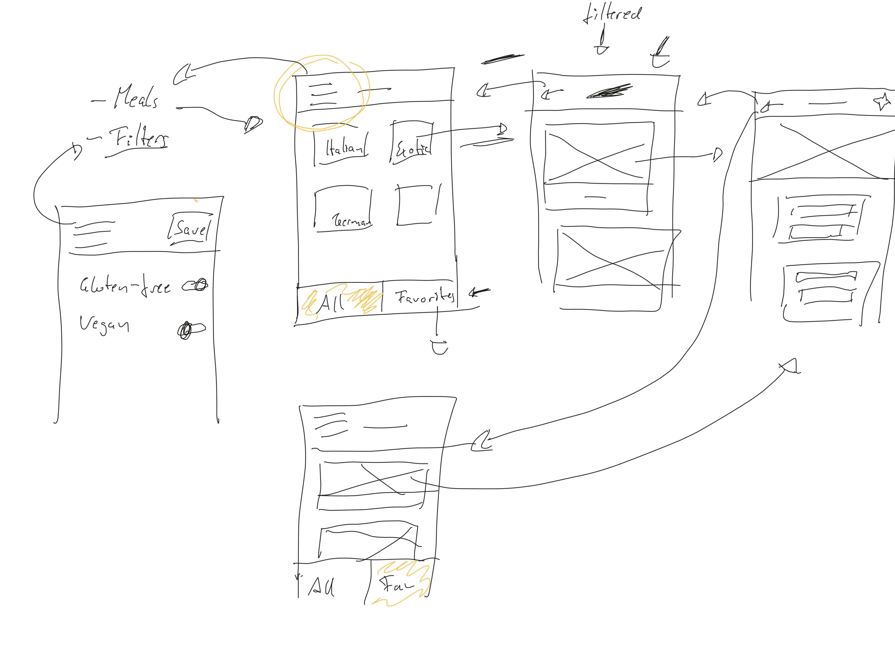

# React Training BHK

## Meal App

### App Idea



[Source](https://www.udemy.com/course/react-native-the-practical-guide/)

This implementation uses the vanilla **react-native-cli** (or bare) workflow and **React Navigation v5**.

### Todo

- [x] Use react navigation v5 to control screens
- [ ] Add demo
- [ ] Build apk

### Setup

The following components should have been included inside the project, but if they have not, please follow the setup steps below and in their respective documentation

#### Add fonts

Create a file `react-native.config.js` in the parent's folder of the project

#### [Add react-navigation/native](https://reactnavigation.org/docs/getting-started)

```bash
npm install @react-navigation/native
```

Install dependencies

```bash
npm install react-native-reanimated react-native-gesture-handler react-native-screens react-native-safe-area-context @react-native-community/masked-view
```

Add the code below to `App.js`

```js
import 'react-native-gesture-handler';
import * as React from 'react';
import { NavigationContainer } from '@react-navigation/native';

export default function App() {
  return (
    <NavigationContainer>{/* Rest of your app code */}</NavigationContainer>
  );
}
```

#### [Add react-navigation/stack](https://reactnavigation.org/docs/stack-navigator/)

```bash
npm install @react-navigation/stack
```

#### [Add react-navigation-header-buttons](https://github.com/vonovak/react-navigation-header-buttons)

```bash
npm install --save react-navigation-header-buttons
```

1. Create a customized headerbutton component, remember to add `{...props}`
2. Import at least `{HeaderButton, Item}` from the module

```JS
<HeaderButtons HeaderButtonComponent={YourCustomHeaderButtonComponent}>
  <Item title="some_string" otherPropsInDocumentation/>
<HeaderButtons>
``` 

#### [Add react-native-vector-icons](https://github.com/oblador/react-native-vector-icons)

**Bundled Icon Sets**

[Browse all](https://oblador.github.io/react-native-vector-icons/)

    AntDesign by AntFinance 
    Entypo by Daniel Bruce 
    EvilIcons by Alexander Madyankin & Roman Shamin 
    Feather by Cole Bemis & Contributors
    FontAwesome by Dave Gandy
    FontAwesome 5 by Fonticons, Inc.
    Fontisto by Kenan Gündoğan 
    Foundation by ZURB, Inc. 
    Ionicons by Ben Sperry 
    MaterialIcons by Google, Inc. 
    MaterialCommunityIcons by MaterialDesignIcons.com 
    Octicons by Github, Inc. 
    Zocial by Sam Collins 
    SimpleLineIcons by Sabbir & Contributors 

Follow the installation guides for iOS and Android separately

#### [Add react-navigation/bottom-tabs](https://reactnavigation.org/docs/tab-based-navigation/)

```bash
npm install --save @react-navigation/bottom-tabs
```
```JS
import {createBottomTabNavigator} from '@react-navigation/bottom-tabs';
```

#### [Add react-navigation/material-bottom-tabs](https://reactnavigation.org/docs/material-bottom-tab-navigator/)

```bash
npm install --save @react-navigation/material-bottom-tabs react-native-paper
```

```JS
import { createMaterialBottomTabNavigator } from '@react-navigation/material-bottom-tabs';
```

**Note**

*Warnings for react-native-paper*

Require cycles are allowed, but can result in uninitialized values. Consider refactoring to remove the need for a cycle.

#### [Add react-navigation/drawer](https://reactnavigation.org/docs/drawer-navigator)

```bash
npm install --save @react-navigation/drawer
```

```JS
import { createDrawerNavigator } from '@react-navigation/drawer';
```

#### [Add react-navigation/material-top-tabs](https://reactnavigation.org/docs/material-top-tab-navigator/)

```bash
npm install --save  @react-navigation/material-top-tabs react-native-tab-view
```

```JS
import { createMaterialTopTabNavigator } from '@react-navigation/material-top-tabs';
```

### Troubleshooting

#### Nothing was returned from render

Compiler error. [Solution](https://stackoverflow.com/questions/46741247/nothing-was-returned-from-render-this-usually-means-a-return-statement-is-missi)

#### Debug Redux

You can debug Redux in React Native apps with help of the [React Native Debugger tool](https://github.com/jhen0409/react-native-debugger/blob/master/docs/redux-devtools-integration.md)

1. Make sure you got the [React Native Debugger](https://github.com/jhen0409/react-native-debugger) installed

2. Enable JS Debugging in the running app (open development overlay via `CTRL + M` / `CMD + M` on Android devices, CMD + D on iOS devices)

3. Install the [redux-devtools-extension package](https://www.npmjs.com/package/redux-devtools-extension) via 
```
npm install --save-dev redux-devtools-extension
```

4. Enable Redux debugging in your code:

```JS
import { createStore, applyMiddleware } from 'redux';
import { composeWithDevTools } from 'redux-devtools-extension';
 
const store = createStore(reducer, composeWithDevTools());
```

**Important:** Make sure you remove this code when building your app for production!

### References

[Ultimate guide to use custom fonts](https://medium.com/@mehran.khan/ultimate-guide-to-use-custom-fonts-in-react-native-77fcdf859cf4)
